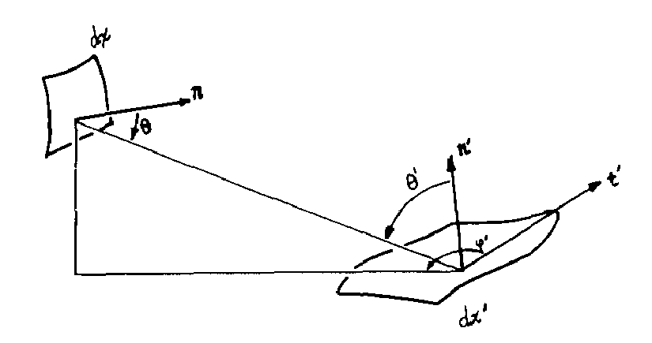
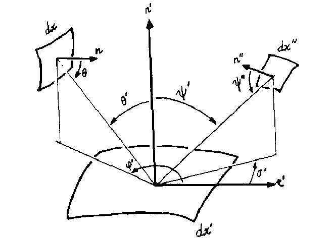

# The Rendering Equation 渲染方程

James T. Kajiya

California Institute of Technology

## 绪论

总结各种方程，归纳已知的渲染算法。我们提出了一种"方差缩减（variance reduction）"，优化基于蒙特卡洛的算法的效率。我们称它为分层采样（Hierarchical Sampling）。The resulting rendering algorithm extends the range of optical phenomena which can be effectively simulated.

## 1. 渲染方程

本文囊括了各种渲染算法，归纳了一个前所未有的上下文（context），从一个方程的视角考察各种渲染算法。所有的渲染它们只是不同程度的近似。毕竟所有的算法都是基于同一个物理现象。

该想法已经有人做过了（Siegel and Howell 1981）。本文介绍的方程更加适合图形学的需求。

我们的渲染方程如下：
$$
I(x,x' )= g(x,x')[\epsilon(x,x')+\int_S \rho(x,x',x'')I(x',x'')dx''] \tag 1
$$
$I(x,x')$ 与从$x'$射到$x$的光线的强度(intensity of light)相关

$g(x,x')$ 几何项(geometry term)

$\epsilon(x,x')$ 与从$x'$散射到$x$的光强(intensity of emitted light)有关

$\rho(x,x',x'')\ $与从$x''$处的平面投射到$x'$的光强(intensity of light)有关 是一个比例系数

该方程和辐射度(radiosity)方程很像。它描述了从一个表面的一个点向另一个表面的一个点投射的光的强度。是散射光(emitted light)和其他点投射(scatter)到$x$的光强的和。公式(1)和辐射度方程的不同在于，没有对表面的反射特征做出假设。

方程中，新的量，称作无遮挡的多点传输量（unoccluded multipoint transport quantities）。第2节，解释这些量，并与辐射方程中的量作类比。

在$S = \cup S_i$积分，所有表面的集合。$x,x',x''$包括了场景中的所有物体的所有表面。同时还有背景$S_0$，一个巨大的半球。封闭表面囊括正半球和负半球。

公式（1）虽然是麦克斯韦电磁学方程的近似，但并没有考虑所有的光学现象。

> “麦克斯韦电磁学方程的近似”——这儿还挺幽默。就像在说太阳能热水器约等于可控核聚变。

两个假设：1.省略时间尺度的积分。2.假设光传播介质均匀不变。

[原文此处介绍了解决上述两个假设的相关研究，省略。]

公式（1）没有考虑波长。

## 2.解释传递量

光子的传播的简单模型。$I(x,x')$描述了辐射能量的传播(energy of radiation)，“无遮挡的两点传输量”=“传输强度”。源$dx'$单位时间单位面积对$dx$单位面积的辐射量。
$$
dE = I(x,x')dtdxdx' \tag 2
$$
$I$的单位是$joule/m^4sec$ (原文是扫描版，此处存疑)

$g(x,x')$是几何项。两点之间不可见为0，如果可见，则为$\frac{1}{r^2}$.注意（半）透明表面的遮挡。

$\epsilon(x,x')$是散射项(emittance term)，描述了从$x'$散射到$x$的能量，“无遮挡的两点散射传输量(unoccluded two point transport emittance)”。描述了源每单位时间每单位面积对目标每单位面积的能量传输。
$$
\begin{align}
dE &= g(x,x')\epsilon(x,x')dtdxdx'\\
&= \frac{1}{r^2}\epsilon(x,x')dtdxdx' 
\end{align}
\tag 3
$$
$\epsilon(x,x')$的单位为$joule/m^2sec$

$\rho(x,x',x'')$是投射项(intensity of energy scattered)。描述了从$x''$发射的能量，投射到$x'$，再作用到$x$的能量。“无遮挡的三点反射传输量(unoccluded three point transport reflectance)”。
$$
\begin{align}
dE &= g(x,x')\rho(x,x',x'')I(x',x'')dtdxdx'dx'' \\
&= \frac{1}{r^2}\rho(x,x',x'')I(x',x'')dtdxdx'dx'' \tag 4
\end{align}
$$
一般的辐射度(ordinary radiometric)定义为，每单位时间每单位立体角每单位投影面积辐射的能量。
$$
dE = i(\theta',\phi')d\omega dx_p'dt \tag 5
$$
将两者关联起来，见图1.

### figure 1

从图中，我们可以得到：
$$
\mathbf r = ||x-x'|| \\
dx_p' = dx'cos\theta\\
cos\theta = \frac{\mathbf n' \cdot( x-x')}{r} \\
cos\theta' = \frac{\mathbf n' \cdot (x- x')}{r}\\
cos\phi' = \frac{t' \cdot ( x - x')}{r}

\tag 6
$$
$\mathbf n \ dx处法向量$

$\mathbf n' \ dx'处法向量$

$\mathbf t'\ dx'处切向量$ 

$r \ x'到x的距离$

关于立体角的定义。和平面角很像。弧长$l = \theta r,r = 半径$。面积$S = \omega r^2, r = 半径$。
$$
d\omega = \frac{dx_p}{r^2} = \frac{1}{r^2}cos\theta dx \tag 7
$$
将公式（7）代入公式（5）得到：
$$
dE = i(\theta', \phi')\frac 1{r^2}cos\theta\, cos\theta'\, dt\, dx\, dx'	\tag 8
$$
这里$cos\theta'\,dx' = dx_p'$ 投影面积的微分

结合公式（2）公式（5），可以得到传输强度(transport intensity)和辐射强度(ordinary intensity)的等式：
$$
I(x, x') = i(\theta', \phi')\frac 1 {r^2}cos\theta\,cos\theta'	\tag 9
$$

$cos\phi'$是计算一个发光源的投射面积，$cos\theta$计算受光表面的投射面积。

传输辐射密度（辐射率）(transport emittance)和通用辐射密度（辐射率）(ordinary emittance)之间的等式也可以类推出来。依然假设没有遮挡、介质均匀，从$dx'$到$dx$的散射传输已经由公式(3)描述. 通用散射量可以由上边的等式类推出来：
$$
\epsilon(x, x') = \epsilon(\theta',\phi')cos\theta cos\theta' \tag {10}
$$
最后，通过等式(11)建立反射传输量(transport reflectance)和通用辐射双向反射方程(ordinary radiometric total bidirectional reflectance function)的关系：
$$
i(\theta', \phi') = \rho(\theta',\phi',\psi',\sigma')i(\psi',\sigma')d\omega''cos\psi' \tag {11}
$$
图2描述了3点之间的能量传输。

### figure 2

参照公式(6)(7)和图2，可以得到：
$$
r'' = ||x'-x''|| \\
dx''_p = dx'' cos\psi'' \\
cos\psi' = \frac{\mathbf n' \cdot (x'-x'')}{r''} \\
cos\psi'' = \frac{\mathbf n'' \cdot (x'-x'')}{r''} \\
cos\sigma' = \frac{\mathbf t' \cdot(x' - x'')}{r''} \\
d\omega'' = \frac{dx''_p}{r''^2} = \frac{cos\psi'' dx''}{r''^2} \tag {12}
$$
其中：

$\mathbf n''$ 是$dx''$的表面法向量

$ r''$ 是表面$x''$到表面$x'$的距离

$d\omega''$是$dx''$的立体角

结合公式(2),(8),(9),(11)和(12)，我们得到了三点无遮挡反射传输量(unoccluded htree point transport)和通用混合双向反射(orinary total bidirectional reflectance)的等式：
$$
\rho(x, x',x'') = \rho(\theta', \phi', \psi', \sigma')cos\theta cos\theta' \tag {13}
$$

## 3. 近似方案

### Neumann series 诺伊曼级数

求解如等式(1)的积分，有一个出名的方法[Courant and Hilbert 1953]. 代入等式(1)抄写如下：
$$
I = g\epsilon + gMI
$$
其中$M$是一个线性算子，从等式(1)中积分得到。

$\int_S \rho(x,x',x'')I(x',x'')dx''$把这一坨当成$MI$，当成线性关系，确是一个近似。**（这里不明白）**

变化一下：
$$
(1 - gM)I = g\epsilon
$$
分离变量，然后泰勒展开：
$$
I
= (1 - gM)^{-1}
= g\epsilon + gMg\epsilon + g\,Mg\,Mg\,\epsilon + g(Mg)^3\epsilon ... \tag 2
$$
当M的谱半径(spectral raidus)小于1时，该无穷级数收敛。将x和x'之间的辐射密度(intensity of radiation)转换成了多项式。

### The Utah approximation 犹他近似

把$I$近似为两项之和：
$$
I = g\epsilon + gM\epsilon_0
$$
该近似省略了除第一次之外的所有投射(scattering)。几何项(geometry term)反而是最难计算得到的。仅为最后的投射(scattering)计算几何项。该几何项牵扯到微平面的遮挡，犹他大学的先前有许多研究者研究这个问题。

值得注意的是,M直接作用于$\epsilon_0$，而没有与$g\epsilon$相乘. 该近似忽略了散射光的可见性，即忽略了影子。$\epsilon_0$表示该近似指支持点辐射光源，不考虑其他表面辐射的光。它把x''的积分简化成了点光源的加和。

### The Ray Tracing approximation 光线追踪近似

Whitted[1980]，提出了一个不同的近似：
$$
I = g\epsilon + gM_0g\epsilon_0 + gM_0gM_0g\epsilon_0 + ...
$$
$M_0$ 是两个$\delta$函数的和与一个cos项。在Whitted的光照模型中，两个$\delta$分别与反射与折射有关。$g \epsilon_0$考虑的点光源辐射及其影子（shadows but with point radiators）。环境光(ambient term)直接用$\epsilon$表示。Again the operator M can be approximated by a small sum.

$\delta$函数，相当于单位冲激函数， 只在0处非零，实数域积分为1。

### The distributed ray tracing approximation 光线追踪近似分布

(distributed  意思应该是采用了一种分布distribution)

[Cook et al 1984]提出了光线追踪近似分布(distributed ray tracing approximation). 它扩展了Whitted[1980]的模型，使用积分计算M. 使用了一个和$\delta$函数相似的分布(distribution)，对这个分布进行积分来计算M. 根据蒙特卡洛原理，将积分转换为求和。这使得很多通过积分计算的对象变得更加容易计算。

然而，关于环境光(ambient term)的近似分布还未解决。

### The radiosity approximation 辐射度近似

1984年，Goral, Torrance, and Greenburg[Goral et. al. 1984, Cohen and Greenburg 1985, Nishita and Nakamae 1985]将辐射度(radiosity)引入计算机图形学。这是一种新的技术，解决了完全漫反射表面的能量守恒。

完全漫反射表面的双面反射方程(bidirectional reflectance function)与角度无关。
$$
\rho(\theta',\phi',\psi',\sigma') = \rho_0 \tag{14}
$$
辐射强度(radiosity)$B(x')$是平面元$dx'$在半球上的能量通量(energy flux)。单位时间通过单位面积上的能量，单位为瓦特/平方米$(W/m^2)$.定义如下：(dx为平面元，是面积)
$$
\begin{align}
dB(x')& = dx'\int_{hemi}i(\theta',\phi')cos\theta'd\omega\\
& = dx'\int_{hemi}\frac{I(x,x')r^2}{cos\theta}d\omega\\
& = dx'\int_S I(x,x')dx
\end{align} \tag{15}
$$

因此可以通过简单的对场景中所有表面积分计算半球的传输量。从公式(1)和公式(15)可以得到：
$$
\begin{align}
dB(x') = dx'\int \{ &g(x,x')\epsilon(x,x')\\
+&g(x,x')\int \rho(x,x',x'')I(x',x'')dx''\}dx
\end{align} \tag{16}
$$
如果在$x$和$x'$之间有遮挡，那么散射项(emittance term)是0. 

> 几何项g = $\frac 1 {r^2}$. 下面是非遮挡的公式。

$$
\begin{align}
dB_e(x') & = dx'\int\frac{\epsilon(x,x')}{r^2}dx \\
& = dx'\int\epsilon(\theta', \phi')cos\theta'\frac{cos\theta dx}{r^2}\\
& = dx' \int\epsilon(\theta', \phi')cos\theta'd\omega\\
& = dx'\pi\epsilon_0
\end{align}
\tag{17}
$$
$\epsilon_0$是表面元$dx'$的散射半球(hemispherical emittance)的积分。

与反射项(reflectance term)类似，如果表面被遮挡，辐射强度也是0. 因此我们可以得到：
$$
\begin{align}
dB_r(x') &= dx'\int\frac{1}{r^2}\int\rho(x,x',x'')I(x',x'')dx''dx\\
&=dx'\int\frac{1}{r_2}\rho(\theta',\phi',\psi',\sigma')cos\theta\cos\theta'dx\times \int I(x',x'')dx'' \\
&=dx'\rho_0\int cos\theta d\omega\int I(x',x'')dx''\\
& = dx'\rho_0\pi H(x')
\end{align} \tag{18}
$$
其中$H$是半球每秒每单位面积的入射能量。

在上式中，我们使用了公式(13),(12)和(14)并且变换了积分顺序。

然后将公式(17)(18)代入公式(16)，我们得到：
$$
dB(x') = \pi[\epsilon_0 + \rho_0H(x')]dx'\tag{19}
$$
Which is equation (4) in Goral et. al.[1984].

> “与文章(Goral等[1984])中的公式(4)如出一辙”. 

在计算最终矩阵$F_{ij}$中，积分$H$的计算是一个重头。显然，它的时间复杂度非常高。该矩阵的计算使用了一些近似(relaxation)公式，相当于计算了诺伊曼级数(Neumann series)的前几项：计算散射光的大概4次投射(progating the emitters across four or so scatterers)。近似(relaxation)反映了场景中所有表面的强度。使用这些近似需要计算整个矩阵。在某些情况下，这些反而是优点。比如下面将要介绍的蒙特卡洛方法(monte carlo method)。

> 这段没怎么懂，翻译得迷迷糊糊。

## 4. Markov chains for solving integral equations 使用马尔科夫链求解积分方程

积分方程的数值解经常使用马尔科夫链的方法来解决。该方法广泛出现在各个领域来进行理论分析和自然物理量的传递。蒙特卡洛马尔科夫链(monte carlo Markov chain)已经拿来实用很久了[Siegel and Howell 1981]。比如用来计算热辐射。热辐射从辐射源以一定的波长散射、反射然后被封闭空间吸收。计算每一次吸收和反射明显是一个不好对付的问题。热辐射的计算近似于追踪光源的光线抵达眼睛。但是与热辐射不同，我们要用更直接的方式，回到...(Rather than follow these methods, we will choose to solve eq.(1) more directly going back to an early monte carlo method first put forth by von Neumann and Ulam[Rubenstein 1981])
